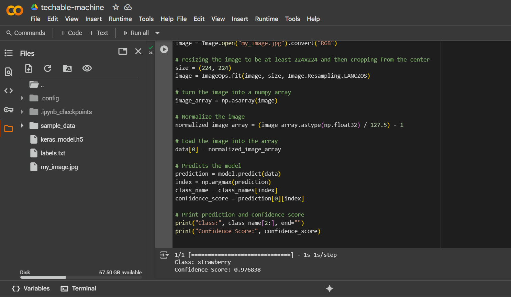
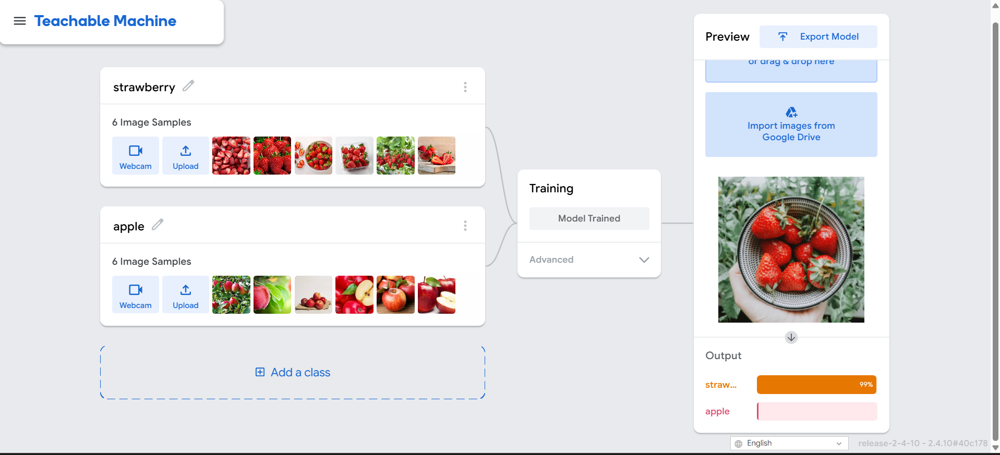

# 🧠 Teachable Machine Image Classifier

An image classification project using a pre-trained model from [Teachable Machine](https://teachablemachine.withgoogle.com/), deployed and tested in Google Colab.

---

## 📁 Project Structure

- `keras_model.h5` — Pre-trained Keras model exported from Teachable Machine.  
- `labels.txt` — Text file containing class labels.  
- `my_image.jpg` — Sample image used for prediction.  
- `classifier.ipynb` — (Optional) Jupyter Notebook for running the model.  

---

## 🚀 How to Use

### 1. Upload Files to Colab

Make sure the following files are uploaded to your Colab environment:
- `keras_model.h5`
- `labels.txt`
- An input image like `my_image.jpg`

## 🖼️ Sample Output

`Class: Strawberry
Confidence Score: 0.97`

## ✅ Model Classes

- Strawberry 🍓

- Apple 🍎

## 🛠️ Built With

- Teachable Machine by Google

- Keras / TensorFlow

- Google Colab

## Google Colab link

  

## 📸 Results

### 🔍 Colab Prediction Output

### 🧠 Techable Machine Model Preview

